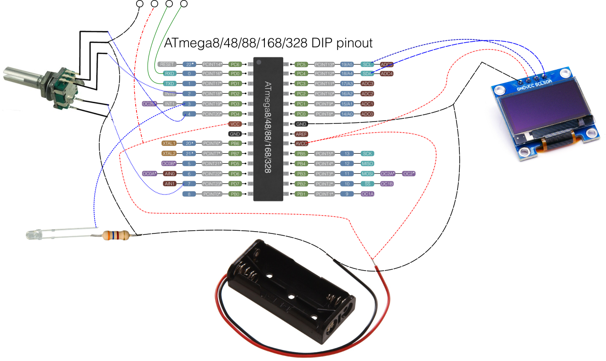

# dcm2068-ir-remote
An ATmega328P based arduino project for remote controlling philips media players through infrared.

You'll need:
- SSD1306 128x64 OLED screen
- Rotary encoder
- IR transmitter LED
- Power source 3~5V (I've used 2xAAA batteries)
- 16 Mhz Oscillator (Not in schematic. Look it up in ATmega328P reference)

